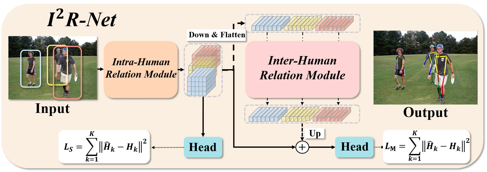
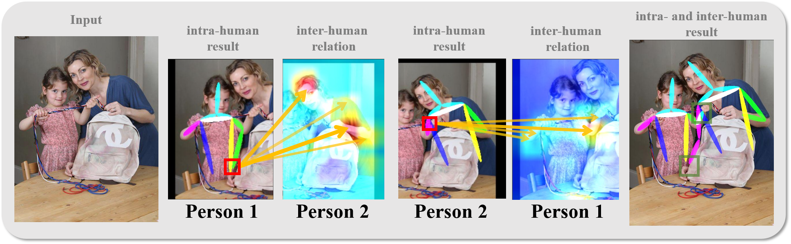

## Introduction:

This code repository for the paper:  
**I²R-Net: Intra- and Inter-Human Relation Network for Multi-Person Pose Estimation**  
[Yiwei Ding, Wenjin Deng, Yinglin Zheng, Pengfei Liu, Meihong Wang, Xuan Cheng, Jianmin Bao, Dong Chen, Ming Zeng]  





## Model Zoo

### Results on CrowdPose testing set

|     Model      | Input size |  AP    | Ap .5 | AP .75 |  AR    | AR .5  | AR .75 | AP easy | AP medium | AP hard | Download | Log |
| :------------: | :--------: |  ----- | ----- | :----: | :----: | :----: | :----: | :-----: | :-------: | :-----: | :------: | --- |
| I²R-Net (Vanilla version, 1st stage:HRNet-W48-S) |  256x192  | 0.723 | 0.924 | 0.779  | 0.765  | 0.932 | 0.819 | 0.799 | 0.732  | 0.628 | [model](https://github.com/leijue222/Intra-and-Inter-Human-Relation-Network-for-MPEE/releases/download/models/interformer_crowdpose_w48_pure_en6.pth) | [log](https://github.com/leijue222/Intra-and-Inter-Human-Relation-Network-for-MPEE/releases/download/logs/GT_True_valid_interformer_crowdpose_w48_pure_en6_2022-05-23-21-23.log) |
| I²R-Net (1st stage:TransPose-H) |  256x192  | 0.763 | 0.935 | 0.822  | 0.791  | 0.940 | 0.844 | 0.832 | 0.770  | 0.674 | [model](https://github.com/leijue222/Intra-and-Inter-Human-Relation-Network-for-MPEE/releases/download/models/interformer_crowdpose_tph_192_p6_b4.pth) | [log](https://github.com/leijue222/Intra-and-Inter-Human-Relation-Network-for-MPEE/releases/download/logs/GT_True_valid_interformer_crowdpose_tph_192_p6_b4_2022-05-23-21-12.log) |
| I²R-Net (1st stage:HRFormer-B) |  256x192  | 0.774 | 0.936 | 0.833  | 0.803  | 0.945 | 0.855 | 0.838 | 0.781  | 0.693 | [model](https://github.com/leijue222/Intra-and-Inter-Human-Relation-Network-for-MPEE/releases/download/models/interformer_crowdpose_hrt_192_p4_b4.pth) | [log](https://github.com/leijue222/Intra-and-Inter-Human-Relation-Network-for-MPEE/releases/download/logs/GT_True_valid_interformer_crowdpose_tph_192_p6_b4_2022-05-23-21-12.log) |


### Results on OCHuman valiadation set

|     Model      | Input size |  AP    | Ap .5 | AP .75 | Download | Log |
| :------------: | :--------: |  ----- | ----- | :----: | :------: | --- |
| I²R-Net (Vanilla version, 1st stage:HRNet-W48-S) |  256x192  | 0.643 | 0.850 | 0.692  | [model](https://github.com/leijue222/Intra-and-Inter-Human-Relation-Network-for-MPEE/releases/download/models/interformer_ochuman_w48_pure_en6.pth) | [log](https://github.com/leijue222/Intra-and-Inter-Human-Relation-Network-for-MPEE/releases/download/logs/GT_True_valid_interformer_ochuman_w48_pure_en6_2022-05-23-20-34.log) |
| I²R-Net (1st stage:TransPose-H) |  256x192  | 0.665 | 0.838 | 0.714  | [model](https://github.com/leijue222/Intra-and-Inter-Human-Relation-Network-for-MPEE/releases/download/models/interformer_ochuman_tph_192_p3_b8.pth) | [log](https://github.com/leijue222/Intra-and-Inter-Human-Relation-Network-for-MPEE/releases/download/logs/GT_True_valid_interformer_ochuman_tph_192_p3_b8_2022-05-23-20-35.log) |
| I²R-Net (1st stage:HRFormer-B) |  256x192  | 0.678 | 0.850 | 0.728  | [model](https://github.com/leijue222/Intra-and-Inter-Human-Relation-Network-for-MPEE/releases/download/models/interformer_ochuman_hrt_192_p3_b8.pth) | [log](https://github.com/leijue222/Intra-and-Inter-Human-Relation-Network-for-MPEE/releases/download/logs/GT_True_valid_interformer_ochuman_hrt_192_p3_b8_2022-05-23-20-37.log) |


### Results on COCO val2017 with detector

|     Model      | Input size |  AP    | Ap .5 | AP .75 | AP (M) | AP (L) |  AR   | AR (M) | AR (L) | Download | Log |
| :------------: | :--------: |  ----- | ----- | :----: | :----: | :----: | :---: | :----: | :----: | :------: | --- |
| I²R-Net (Vanilla version, 1st stage:HRNet-W48-S) |  256x192  | 0.753 | 0.902 | 0.819  | 0.717  | 0.824  | 0.805 | 0.761  | 0.868  | [model](https://github.com/leijue222/Intra-and-Inter-Human-Relation-Network-for-MPEE/releases/download/models/interformer_coco_w48_pure_en6.pth) | [log](https://github.com/leijue222/Intra-and-Inter-Human-Relation-Network-for-MPEE/releases/download/logs/GT_False_valid_interformer_coco_w48_pure_en6_2022-05-23-21-43.log) |
| I²R-Net (1st stage:TransPose-H) |  256x192  | 0.758 | 0.904 | 0.821  | 0.720  | 0.829  | 0.809 | 0.766  | 0.873  | [model](https://github.com/leijue222/Intra-and-Inter-Human-Relation-Network-for-MPEE/releases/download/models/interformer_coco_tph_192_p4_b4.pth) | [log](https://github.com/leijue222/Intra-and-Inter-Human-Relation-Network-for-MPEE/releases/download/logs/GT_False_valid_interformer_coco_tph_192_p4_b4_2022-05-23-21-42.log) |
| I²R-Net (1st stage:HRFormer-B) |  256x192  | 0.764 | 0.908 | 0.832  | 0.723  | 0.837  | 0.814 | 0.769  | 0.881  | [model](https://github.com/leijue222/Intra-and-Inter-Human-Relation-Network-for-MPEE/releases/download/models/interformer_coco_hrt_192_p2_b12.pth) | [log](https://github.com/leijue222/Intra-and-Inter-Human-Relation-Network-for-MPEE/releases/download/logs/GT_False_valid_interformer_coco_hrt_192_p2_b12_2022-05-23-21-59.log) |
| I²R-Net (1st stage:HRFormer-B) |  384x288  | 0.773 | 0.910 | 0.836  | 0.730  | 0.845  | 0.821 | 0.777  | 0.886  | [model](https://github.com/leijue222/Intra-and-Inter-Human-Relation-Network-for-MPEE/releases/download/models/interformer_coco_hrt_288_p2_b4.pth) | [log](https://github.com/leijue222/Intra-and-Inter-Human-Relation-Network-for-MPEE/releases/download/logs/GT_False_valid_interformer_coco_hrt_288_p2_b4_2022-05-23-22-33.log) |

## Getting started

### Installation

1. Clone this repository, and we'll call the directory that you cloned as ${POSE_ROOT}

   ```bash
   git clone https://github.com/leijue222/InterFormer.git
   ```

2. Install **Python=3.8 and PyTorch=1.10** from the PyTorch [official website](https://pytorch.org/get-started/locally/)

3. Install package dependencies.

   ```bash
   pip install -r requirements.txt
   ```

   ```bash
   git clone https://github.com/Jeff-sjtu/CrowdPose.git
   cd CrowdPose/crowdpose-api/PythonAPI/
   sh install.sh
   cd ../../../
   rm -rf CrowdPose
   ```
   ```bash
   git clone https://github.com/liruilong940607/OCHumanApi
   cd OCHumanApi
   make install
   cd ..
   rm -rf OCHumanApi
   ```
   ```bash
   cd ${POSE_ROOT}/lib
   make
   ```
### Pretrained Models

Download pretrained models from our [Model Zoo](https://github.com/leijue222/Intra-and-Inter-Human-Relation-Network-for-MPEE#model-zoo).

```
${POSE_ROOT}/models/
`-- crowdpose
	|-- interformer_crowdpose_w48_pure_en6.pth
	|-- interformer_crowdpose_tph_192_p6_b4.pth
	|-- interformer_crowdpose_hrt_192_p4_b4.pth
`-- ochuman
	|-- interformer_ochuman_w48_pure_en6.pth
	|-- interformer_ochuman_tph_192_p3_b8.pth
	|-- interformer_ochuman_hrt_192_p3_b8.pth
`-- coco
	|-- interformer_coco_w48_pure_en6.pth
	|-- interformer_coco_tph_192_p4_b4.pth
	|-- interformer_coco_hrt_192_p2_b12.pth
	|-- interformer_coco_hrt_288_p2_b4.pth
```

### Data Preparation

#### CrowPose dataset

Downloaded images from [here](https://github.com/Jeff-sjtu/CrowdPose#Dataset), json file can also download from [here](https://github.com/leijue222/Intra-and-Inter-Human-Relation-Network-for-MPEE/releases/tag/json).
```txt
${POSE_ROOT}/data/crowdpose/
|-- json
|   |-- crowdpose_train.json
|   |-- crowdpose_val.json
|   |-- crowdpose_trainval.json
|   `-- crowdpose_test.json
`-- images
	|-- 100000.jpg
	|-- ... 
```

#### OCHuman dataset

Downloaded images from [here](https://drive.google.com/file/d/10hJ2OPWTlpfcnKGlj3MTirEC8L9AhEce/view?usp=sharing), json file can also download from [here](https://github.com/leijue222/Intra-and-Inter-Human-Relation-Network-for-MPEE/releases/tag/json).
```txt
${POSE_ROOT}/data/crowdpose/
|-- ochuman_coco_format_val_range_0.00_1.00
|-- ochuman_coco_format_test_range_0.00_1.00.json
`-- images
	|-- 000001.jpg
	|-- ... 
```

#### COCO dataset
We follow the steps of [HRNet](https://github.com/leoxiaobin/deep-high-resolution-net.pytorch#data-preparation) to prepare the COCO train/val/test dataset and the annotations. The detected person results are downloaded from [OneDrive](https://1drv.ms/f/s!AhIXJn_J-blWzzDXoz5BeFl8sWM-) or [GoogleDrive](https://drive.google.com/drive/folders/1fRUDNUDxe9fjqcRZ2bnF_TKMlO0nB_dk?usp=sharing). Please download or link them to ${POSE_ROOT}/data/coco/, and make them look like this:

```txt
${POSE_ROOT}/data/coco/
|-- annotations
|   |-- person_keypoints_train2017.json
|   `-- person_keypoints_val2017.json
|-- person_detection_results
|   |-- COCO_val2017_detections_AP_H_56_person.json
|   `-- COCO_test-dev2017_detections_AP_H_609_person.json
`-- images
	|-- train2017
	|   |-- 000000000009.jpg
	|   |-- ... 
	`-- val2017
		|-- 000000000139.jpg
		|-- ... 
```

### Training & Testing

#### Training sample

```bash
torchrun --nproc_per_node=8 tools/ddp_train.py --cfg experiments/crowdpose/interformer_crowdpose_w48_pure_en6.yaml
torchrun --nproc_per_node=8 tools/ddp_train.py --cfg experiments/OCHuman/interformer_ochuman_tph_192_p3_b8.yaml
torchrun --nproc_per_node=8 tools/ddp_train.py --cfg experiments/coco/interformer_coco_hrt_288_p2_b4.yaml
```

#### Testing sample

```bash
python tools/test.py --cfg experiments/crowdpose/interformer_crowdpose_w48_pure_en6.yaml
python tools/test.py --cfg experiments/OCHuman/interformer_ochuman_tph_192_p3_b8.yaml
python tools/test.py --cfg experiments/coco/interformer_coco_hrt_288_p2_b4.yaml TEST.USE_GT_BBOX False
python tools/test.py --cfg experiments/coco/interformer_coco_hrt_288_p2_b4.yaml TEST.USE_GT_BBOX True
```


### Acknowledgements

Great thanks for these papers and their open-source codes：[HRNet](https://github.com/leoxiaobin/deep-high-resolution-net.pytorch),  [TransPose](https://github.com/yangsenius/TransPose), [HRFormer](https://github.com/HRNet/HRFormer)


## Citation
If you use our code or models in your research, please cite with:

We will update the codes and models soon.
